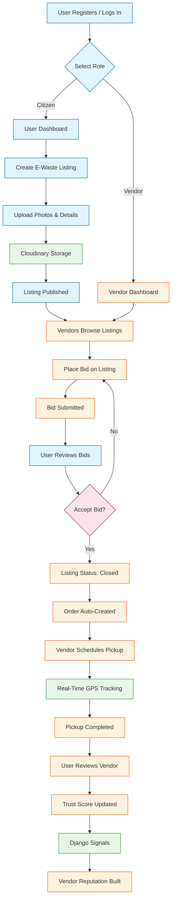

# E-Waste Recycling Marketplace

A production-ready full-stack platform connecting environmentally conscious citizens with certified e-waste recyclers. Users can list electronic waste, vendors can bid on items, and the system manages the entire pickup and recycling workflow with real-time tracking.

## 🚀 Features

### User Features
- **List E-Waste**: Post electronic items for recycling with photos and descriptions
- **Track Pickups**: Real-time GPS tracking of vendor pickups
- **Review Vendors**: Rate and review vendors to build community trust
- **Dashboard**: Personal dashboard to manage listings and track orders

### Vendor Features
- **Browse Listings**: View available e-waste items with filtering
- **Place Bids**: Compete for listings with competitive pricing
- **Pickup Management**: Schedule and manage pickup routes
- **Trust Score**: Build reputation through positive reviews

### Platform Features
- **Role-Based Access**: Separate permissions for users and vendors
- **JWT Authentication**: Secure login with token refresh
- **Bidding Engine**: Atomic bid acceptance with automatic order creation
- **Real-Time Updates**: WebSocket support for live notifications
- **Image Uploads**: Cloudinary integration for listing photos
- **Trust System**: Vendor scoring based on user reviews

## 🔄 Application Flow



### Flow Steps

1. **Authentication**: Users register/login and select their role (Citizen or Vendor)
2. **Listing Creation**: Citizens create e-waste listings with photos uploaded to Cloudinary
3. **Bidding**: Vendors browse open listings and place competitive bids
4. **Bid Acceptance**: Citizen reviews bids and accepts one, atomically closing the listing
5. **Order Creation**: System automatically generates an order from the accepted bid
6. **Pickup Execution**: Vendor schedules pickup with real-time GPS tracking via Google Maps
7. **Review & Trust**: After completion, citizen reviews vendor; trust score updates via Django signals

## 🛠️ Tech Stack

### Backend
- **Framework**: Django REST Framework
- **Authentication**: SimpleJWT
- **Database**: PostgreSQL (Supabase-ready) / SQLite (development)
- **Real-Time**: Django Channels (WebSockets)
- **Image Storage**: Cloudinary
- **Static Files**: WhiteNoise
- **API Documentation**: drf-spectacular (Swagger/OpenAPI)

### Frontend
- **Framework**: React 18 + Vite
- **Styling**: Tailwind CSS + HeadlessUI
- **State Management**: Zustand (auth) + React Query (data)
- **Routing**: React Router v6
- **Maps**: @react-google-maps/api
- **Animations**: Framer Motion
- **Forms**: React Hook Form
- **Notifications**: React Hot Toast
- **Icons**: Lucide React + Heroicons

## 📁 Project Structure

```
E-Waste Recycling Marketplace/
├── backend/
│   ├── apps/
│   │   ├── users/          # User management, auth, permissions
│   │   ├── listings/       # E-waste listing CRUD and filtering
│   │   ├── bids/           # Vendor bidding system
│   │   ├── orders/         # Order management and tracking
│   │   ├── reviews/        # Vendor review and trust scoring
│   │   └── realtime/       # WebSocket consumers for live updates
│   ├── config/
│   │   └── settings/       # Split settings (development/production)
│   ├── utils/
│   │   ├── cloudinary_upload.py
│   │   ├── geo.py          # Haversine distance calculations
│   │   ├── pagination.py
│   │   └── throttling.py
│   ├── manage.py
│   └── Procfile            # Deployment config
└── frontend/
    ├── src/
    │   ├── api/            # Axios instances and endpoint helpers
    │   ├── components/     # Reusable UI components
    │   ├── hooks/          # Custom hooks (GPS, React Query)
    │   ├── pages/
    │   │   ├── auth/       # Login/Register pages
    │   │   ├── user/       # User dashboard pages
    │   │   └── vendor/     # Vendor dashboard pages
    │   ├── store/          # Zustand auth store
    │   └── App.jsx
    └── tailwind.config.js
```

## 🏁 Getting Started

### Prerequisites
- Python 3.10+
- Node.js 18+
- npm or yarn

### Backend Setup

1. Navigate to the backend directory:
```bash
cd backend
```

2. Create and activate a virtual environment:
```bash
python -m venv venv
venv\Scripts\activate  # Windows
source venv/bin/activate  # Linux/Mac
```

3. Install dependencies:
```bash
pip install -r requirements.txt
```

4. Configure environment variables:
```bash
cp .env.example .env
# Edit .env with your configuration
```

5. Run migrations:
```bash
python manage.py migrate
```

6. Create a superuser (optional):
```bash
python manage.py createsuperuser
```

7. Start the development server:
```bash
python manage.py runserver
```

- **API Root**: http://localhost:8000/api/
- **Swagger Docs**: http://localhost:8000/api/docs/
- **Admin Panel**: http://localhost:8000/admin/

### Frontend Setup

1. Navigate to the frontend directory:
```bash
cd frontend
```

2. Install dependencies:
```bash
npm install
```

3. Configure environment variables:
```bash
cp .env.example .env  # if available
```

4. Start the development server:
```bash
npm run dev
```

- **App URL**: http://localhost:5173/

## 🔧 Environment Variables

### Backend (.env)
| Variable | Description |
|----------|-------------|
| `SECRET_KEY` | Django security key |
| `DJANGO_SETTINGS_MODULE` | `config.settings.development` or `config.settings.production` |
| `DATABASE_URL` | PostgreSQL connection string |
| `CLOUDINARY_CLOUD_NAME` | Cloudinary cloud name |
| `CLOUDINARY_API_KEY` | Cloudinary API key |
| `CLOUDINARY_API_SECRET` | Cloudinary API secret |
| `ALLOWED_HOSTS` | Comma-separated allowed hosts |
| `CORS_ALLOWED_ORIGINS` | Comma-separated CORS origins |

## 📡 API Endpoints

### Authentication
- `POST /api/auth/token/` - Login and get JWT tokens
- `POST /api/auth/token/refresh/` - Refresh access token
- `POST /api/auth/register/` - Register new user

### Users
- `GET /api/users/me/` - Get current user profile
- `PUT /api/users/me/` - Update profile

### Listings
- `GET /api/listings/` - List all e-waste listings (filterable)
- `POST /api/listings/` - Create new listing
- `GET /api/listings/{id}/` - Get listing details
- `PUT /api/listings/{id}/` - Update listing
- `DELETE /api/listings/{id}/` - Delete listing

### Bids
- `GET /api/bids/` - List bids
- `POST /api/bids/` - Place a bid on a listing
- `POST /api/bids/{id}/accept/` - Accept a bid (creates order)

### Orders
- `GET /api/orders/` - List orders
- `GET /api/orders/{id}/` - Get order details
- `PUT /api/orders/{id}/status/` - Update order status

### Reviews
- `GET /api/reviews/` - List reviews
- `POST /api/reviews/` - Create review for vendor
- `GET /api/vendors/{id}/reviews/` - Get vendor reviews

## 🧪 Testing

### Backend
```bash
cd backend
pytest
```

### Frontend
```bash
cd frontend
npm run lint
```

## 🚢 Deployment

### Backend
The backend is configured for deployment on platforms like Heroku, Railway, or Render:
- `Procfile` is included for web process configuration
- `runtime.txt` specifies Python version
- Production settings use PostgreSQL and Cloudinary

### Frontend
The frontend can be deployed on Vercel, Netlify, or any static hosting:
```bash
npm run build
```

## 📝 License

This project is built for educational and environmental purposes.

## 🤝 Contributing

1. Fork the repository
2. Create a feature branch
3. Commit your changes
4. Push to the branch
5. Open a Pull Request
