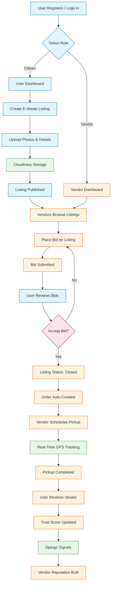

# VoltSwap | E-Waste Recycling Marketplace

A production-ready full-stack platform connecting environmentally conscious citizens with certified e-waste recyclers. Users list electronic waste for recycling, vendors bid on listings, and the system manages the entire pickup workflow with real-time GPS tracking, OTP verification, and a vendor trust scoring system.

**Frontend Branded As:** VoltSwap -- The Global Hardware Exchange

## Features

### User (Citizen) Features
- **List E-Waste**: Post electronic items with photos, descriptions, category, and condition
- **Manage Listings**: View, edit, and delete your listings with auto-incrementing view counts
- **Review Bids**: Compare vendor bids on your listings
- **Accept Bids**: One-click acceptance atomically closes listing, rejects other bids, and auto-creates an order
- **Track Pickups**: Real-time GPS tracking of vendor pickups on Google Maps
- **OTP Verification**: Secure pickup confirmation with one-time passwords
- **Review Vendors**: Rate vendors (1-5 stars) with comments after pickup completion
- **Dashboard**: Personal dashboard to manage all listings and orders

### Vendor Features
- **Browse Listings**: Filter open listings by category, status, and geographic proximity
- **Place Bids**: Submit competitive pricing (one bid per vendor per listing; re-bidding updates)
- **Manage Pickups**: View assigned orders and update status through the full lifecycle
- **GPS Tracking**: Push real-time location for citizen tracking
- **OTP Verification**: Confirm pickups with citizen-provided OTP
- **Trust Score**: Build reputation through positive reviews (auto-calculated average rating)

### Platform Features
- **Role-Based Access Control**: Separate permissions for citizens (`IsUser`) and vendors (`IsVendor`)
- **JWT Authentication**: Secure login with 15-min access tokens, 7-day refresh tokens, and automatic rotation
- **Atomic Bid Acceptance**: Django `transaction.atomic()` ensures listing closure, bid acceptance, other bid rejection, and order creation happen as one atomic operation
- **Real-Time WebSocket Notifications**: Django Channels consumer for live bid updates, status changes, and location updates
- **Image Uploads**: Cloudinary integration for listing photos
- **Vendor Trust System**: Django `post_save` signal on Review automatically recalculates vendor scores
- **Geographic Filtering**: Haversine distance calculation for nearby listings
- **API Rate Throttling**: 100/hour anonymous, 1000/hour authenticated, 10/hour for bid creation
- **Model History Tracking**: `django-simple-history` on Listing and Order models
- **Swagger/OpenAPI Docs**: Auto-generated interactive API documentation

## Application Flow



### Flow Steps

1. **Authentication**: Users register/login and select their role (Citizen or Vendor)
2. **Listing Creation**: Citizens create e-waste listings with photos uploaded to Cloudinary
3. **Bidding**: Vendors browse open listings and place competitive bids
4. **Bid Acceptance**: Citizen reviews bids and accepts one, atomically closing the listing
5. **Order Creation**: System automatically generates an order from the accepted bid
6. **Pickup Execution**: Vendor schedules pickup with real-time GPS tracking via Google Maps
7. **Review & Trust**: After completion, citizen reviews vendor; trust score updates via Django signals

## Tech Stack

### Backend
| Category | Technology |
|---|---|
| Framework | Django 4.x + Django REST Framework |
| Authentication | djangorestframework-simplejwt (JWT with access + refresh tokens) |
| Database | PostgreSQL (production via Supabase) / SQLite (development) |
| Real-Time | Django Channels + Daphne (ASGI server for WebSockets) |
| Image Storage | Cloudinary |
| Static Files | WhiteNoise (production) |
| API Documentation | drf-spectacular (Swagger/OpenAPI) |
| Filtering | django-filter |
| Model History | django-simple-history |
| Config Management | python-dotenv, dj-database-url |
| Linting | flake8 |
| Testing | pytest (pytest-django) |
| Deployment | Gunicorn + Procfile (Heroku/Railway/Render) |
| Python Version | 3.11.9 |

### Frontend
| Category | Technology |
|---|---|
| Framework | React 18 |
| Build Tool | Vite 5 |
| Styling | Tailwind CSS 3 + HeadlessUI + @tailwindcss/forms |
| State Management | Zustand (with persist middleware, sessionStorage-backed) |
| Data Fetching | React Query 3 (with optimistic updates) |
| Routing | React Router v6 |
| HTTP Client | Axios (with JWT interceptors and auto-refresh) |
| Maps | @react-google-maps/api |
| Animations | Framer Motion |
| Forms | React Hook Form |
| File Upload | react-dropzone |
| Notifications | React Hot Toast |
| Icons | Lucide React + Heroicons |
| Utilities | clsx, tailwind-merge, date-fns, react-loading-skeleton |
| Linting | ESLint (with React plugins) |
| Formatting | Prettier (+ prettier-plugin-tailwindcss) |
| Fonts | Outfit + Inter (Google Fonts) |

## Project Structure

```
E-Waste Recycling Marketplace/
├── backend/
│   ├── .env                          # Environment variables (secrets)
│   ├── .env.example                  # Template for env vars
│   ├── .flake8                       # Flake8 linting config
│   ├── db.sqlite3                    # Development SQLite database
│   ├── manage.py                     # Django management script
│   ├── Procfile                      # Deployment: gunicorn config
│   ├── pytest.ini                    # Pytest configuration
│   ├── runtime.txt                   # Python 3.11.9
│   ├── apps/
│   │   ├── users/                    # Custom user model, auth, permissions
│   │   │   ├── models.py             # CustomUser (UUID PK, email auth, role-based)
│   │   │   ├── views.py              # Register, Login (JWT), Profile, Public user
│   │   │   ├── serializers.py        # Register, Token, UserProfile serializers
│   │   │   ├── urls.py               # /auth/register/, /auth/login/, /auth/profile/, etc.
│   │   │   ├── permissions.py        # IsVendor, IsUser, IsOwner
│   │   │   └── admin.py              # CustomUserAdmin
│   │   ├── listings/                 # E-waste listing CRUD
│   │   │   ├── models.py             # Listing (category, condition, status, GPS, image)
│   │   │   ├── views.py              # ListingViewSet (CRUD + image upload + geo filtering)
│   │   │   ├── serializers.py        # ListingSerializer
│   │   │   ├── urls.py               # DRF router
│   │   │   ├── filters.py            # ListingFilter (category, status, nearby)
│   │   │   └── admin.py              # ListingAdmin
│   │   ├── bids/                     # Vendor bidding system
│   │   │   ├── models.py             # Bid (listing FK, vendor FK, amount, status)
│   │   │   ├── views.py              # BidViewSet (create, accept, reject + WS notifications)
│   │   │   ├── serializers.py        # BidSerializer
│   │   │   ├── urls.py               # DRF router
│   │   │   └── admin.py              # BidAdmin
│   │   ├── orders/                   # Order management and tracking
│   │   │   ├── models.py             # Order (listing 1:1, bid 1:1, GPS, OTP, status)
│   │   │   ├── views.py              # OrderViewSet (status, location, verify_otp, get_location)
│   │   │   ├── serializers.py        # OrderSerializer, OrderLocationSerializer
│   │   │   ├── urls.py               # DRF router
│   │   │   └── admin.py              # OrderAdmin
│   │   ├── reviews/                  # Vendor review and trust scoring
│   │   │   ├── models.py             # Review + post_save signal for vendor_score
│   │   │   ├── views.py              # ReviewViewSet
│   │   │   ├── serializers.py        # ReviewSerializer
│   │   │   ├── urls.py               # DRF router
│   │   │   └── admin.py              # ReviewAdmin
│   │   └── realtime/                 # WebSocket consumers
│   │       ├── consumers.py          # NotificationConsumer (JWT-authenticated WS)
│   │       └── routing.py            # ws/notifications/
│   ├── config/
│   │   ├── settings/
│   │   │   ├── base.py               # Shared settings (INSTALLED_APPS, REST_FRAMEWORK, JWT, Cloudinary)
│   │   │   ├── development.py        # DEBUG=True, SQLite, CORS for localhost:5173
│   │   │   └── production.py         # DEBUG=False, PostgreSQL (dj-database-url), WhiteNoise, SSL/HSTS
│   │   ├── urls.py                   # Root URL routing (admin, api/*, swagger docs)
│   │   ├── asgi.py                   # ASGI config with Channels + WebSocket routing
│   │   └── wsgi.py                   # WSGI config for Gunicorn
│   └── utils/
│       ├── cloudinary_upload.py      # Cloudinary upload/delete helpers
│       ├── geo.py                    # Haversine distance calculation
│       ├── pagination.py             # StandardResultsPagination (page_size=12)
│       └── throttling.py             # BidRateThrottle (10/hour)
│
└── frontend/
    ├── .env                          # VITE_API_BASE_URL, VITE_GOOGLE_MAPS_KEY
    ├── .prettierrc                   # Prettier config
    ├── index.html                    # HTML entry (title: "VoltSwap | The Global Hardware Exchange")
    ├── package.json                  # Dependencies and scripts
    ├── postcss.config.js             # PostCSS config
    ├── tailwind.config.js            # Tailwind config (custom primary green palette)
    ├── vite.config.js                # Vite config (port 5173, HMR)
    └── src/
        ├── main.jsx                  # React entry (QueryClient, Toaster)
        ├── App.jsx                   # Router + all routes + ProtectedRoute + RealTimeNotification
        ├── index.css                 # Tailwind imports, custom components (glass-panel, etc.)
        ├── api/
        │   ├── axiosInstance.js      # Axios with JWT interceptors + auto-refresh
        │   ├── auth.js               # login, register, getProfile, updateProfile
        │   ├── listings.js           # CRUD + image upload
        │   ├── bids.js               # getBids, placeBid, acceptBid, rejectBid
        │   ├── orders.js             # CRUD + location + OTP
        │   └── reviews.js            # getReviews, createReview
        ├── components/
        │   ├── layout/
        │   │   ├── Navbar.jsx
        │   │   ├── Footer.jsx
        │   │   └── ProtectedRoute.jsx  # Role-based route guard
        │   ├── listings/
        │   │   └── ListingCard.jsx
        │   ├── maps/
        │   │   └── LiveTrackingMap.jsx  # Google Maps with vendor + pickup markers
        │   ├── orders/
        │   │   └── StatusTimeline.jsx
        │   ├── ui/
        │   │   ├── Button.jsx
        │   │   ├── Input.jsx
        │   │   ├── EmptyState.jsx
        │   │   ├── ErrorBoundary.jsx
        │   │   └── RealTimeNotification.jsx  # WebSocket notification UI
        │   └── bids/
        ├── hooks/
        │   ├── useAuth.js            # Auth store wrapper + useUpdateProfile mutation
        │   ├── useListings.js        # useListings, useListing, useCreateListing, useDeleteListing
        │   ├── useBids.js            # useListingBids, usePlaceBid (optimistic), useAcceptBid
        │   ├── useOrders.js          # useOrders, useOrder, useUpdateOrderStatus, useVerifyOTP
        │   ├── useGPS.js             # Geolocation watchPosition with throttling
        │   └── useWebSocket.js       # WebSocket hook with auto-connect
        ├── pages/
        │   ├── Landing.jsx           # Futuristic dark-themed landing page
        │   ├── NotFound.jsx
        │   ├── auth/
        │   │   ├── Login.jsx
        │   │   └── Register.jsx
        │   ├── user/
        │   │   ├── Dashboard.jsx
        │   │   ├── CreateListing.jsx
        │   │   ├── MyListings.jsx
        │   │   ├── ListingDetail.jsx
        │   │   └── TrackPickup.jsx
        │   └── vendor/
        │       ├── VendorDashboard.jsx
        │       ├── BrowseListings.jsx
        │       └── MyPickups.jsx
        └── store/
            └── authStore.js          # Zustand store (multi-account, persist to sessionStorage)
```

## Database Models

### CustomUser (`apps.users`)
| Field | Type | Description |
|---|---|---|
| `id` | UUID | Primary key |
| `email` | EmailField | Unique, login field |
| `full_name` | CharField | User's full name |
| `phone` | CharField | Contact number |
| `avatar_url` | URLField | Profile picture |
| `role` | CharField | `USER` or `VENDOR` |
| `vendor_score` | FloatField | Average rating (default: 5.0) |
| `total_reviews` | IntegerField | Review count (default: 0) |
| `is_verified_vendor` | BooleanField | Vendor verification status |
| `is_active` | BooleanField | Account active status |
| `is_staff` | BooleanField | Admin access |

### Listing (`apps.listings`)
| Field | Type | Description |
|---|---|---|
| `id` | UUID | Primary key |
| `user` | ForeignKey | Owner (CustomUser) |
| `title` | CharField | Listing title |
| `description` | TextField | Item description |
| `category` | CharField | `phone`, `laptop`, `tv`, `appliance`, `other` |
| `condition` | CharField | `good`, `fair`, `poor` |
| `image_url` | URLField | Cloudinary image URL |
| `pickup_lat` | DecimalField | Pickup latitude |
| `pickup_lng` | DecimalField | Pickup longitude |
| `pickup_address` | CharField | Pickup location address |
| `status` | CharField | `open`, `closed`, `completed` |
| `view_count` | IntegerField | Auto-incrementing view counter |

### Bid (`apps.bids`)
| Field | Type | Description |
|---|---|---|
| `id` | UUID | Primary key |
| `listing` | ForeignKey | Target listing |
| `vendor` | ForeignKey | Bidding vendor (CustomUser) |
| `amount` | DecimalField | Bid amount |
| `message` | TextField | Vendor message |
| `status` | CharField | `pending`, `accepted`, `rejected` |

### Order (`apps.orders`)
| Field | Type | Description |
|---|---|---|
| `id` | UUID | Primary key |
| `listing` | OneToOneField | Associated listing |
| `bid` | OneToOneField | Accepted bid |
| `vendor_lat` | DecimalField | Vendor current latitude |
| `vendor_lng` | DecimalField | Vendor current longitude |
| `vendor_last_seen` | DateTimeField | Last GPS update timestamp |
| `status` | CharField | `pending`, `in_transit`, `reached`, `picked_up`, `completed` |
| `scheduled_time` | DateTimeField | Pickup scheduled time |
| `otp` | CharField | 6-character verification code |
| `otp_verified` | BooleanField | OTP verification status |

### Review (`apps.reviews`)
| Field | Type | Description |
|---|---|---|
| `id` | UUID | Primary key |
| `order` | OneToOneField | Associated order |
| `reviewer` | ForeignKey | Review author (CustomUser) |
| `reviewee` | ForeignKey | Reviewed vendor (CustomUser) |
| `rating` | IntegerField | 1-5 star rating |
| `comment` | TextField | Review text |

## Getting Started

### Prerequisites
- Python 3.11+
- Node.js 18+
- npm or yarn
- PostgreSQL (for production) or SQLite (for development)

### Backend Setup

1. Navigate to the backend directory:
```bash
cd backend
```

2. Create and activate a virtual environment:
```bash
python -m venv venv
venv\Scripts\activate  # Windows
source venv/bin/activate  # Linux/Mac
```

3. Install dependencies:
```bash
pip install -r requirements.txt
```

4. Configure environment variables:
```bash
cp .env.example .env
# Edit .env with your configuration
```

5. Run migrations:
```bash
python manage.py migrate
```

6. Create a superuser (optional):
```bash
python manage.py createsuperuser
```

7. Start the development server:
```bash
python manage.py runserver
```

| Service | URL |
|---|---|
| API Root | http://localhost:8000/api/ |
| Swagger Docs | http://localhost:8000/api/docs/ |
| Admin Panel | http://localhost:8000/admin/ |

### Frontend Setup

1. Navigate to the frontend directory:
```bash
cd frontend
```

2. Install dependencies:
```bash
npm install
```

3. Configure environment variables:
```bash
# Create .env file with required variables
```

4. Start the development server:
```bash
npm run dev
```

| Service | URL |
|---|---|
| App | http://localhost:5173/ |

### Available Scripts

#### Frontend
| Command | Description |
|---|---|
| `npm run dev` | Start Vite dev server (port 5173, HMR enabled) |
| `npm run build` | Production build |
| `npm run preview` | Preview production build |
| `npm run lint` | ESLint check |

#### Backend
| Command | Description |
|---|---|
| `python manage.py runserver` | Start Django development server |
| `python manage.py migrate` | Run database migrations |
| `python manage.py createsuperuser` | Create admin user |
| `pytest` | Run test suite |

## Environment Variables

### Backend (`.env`)
| Variable | Description | Required |
|---|---|---|
| `DJANGO_SETTINGS_MODULE` | `config.settings.development` or `config.settings.production` | Yes |
| `SECRET_KEY` | Django cryptographic secret key | Yes |
| `DATABASE_URL` | PostgreSQL connection string (production) | Production only |
| `CLOUDINARY_CLOUD_NAME` | Cloudinary account cloud name | Yes |
| `CLOUDINARY_API_KEY` | Cloudinary API key | Yes |
| `CLOUDINARY_API_SECRET` | Cloudinary API secret | Yes |
| `ALLOWED_HOSTS` | Comma-separated allowed hosts | Yes |
| `CORS_ALLOWED_ORIGINS` | Comma-separated CORS origins | Yes |

### Frontend (`.env`)
| Variable | Description | Required |
|---|---|---|
| `VITE_API_BASE_URL` | Backend API base URL (default: `http://localhost:8000/api`) | Yes |
| `VITE_GOOGLE_MAPS_KEY` | Google Maps JavaScript API key | Yes (for maps) |
| `VITE_WS_HOST` | WebSocket server hostname | Optional |
| `VITE_WS_PORT` | WebSocket server port | Optional |

## API Endpoints

### Authentication (`/api/auth/`)
| Method | Endpoint | Description |
|---|---|---|
| POST | `/api/auth/register/` | Register new user/vendor |
| POST | `/api/auth/login/` | Login, returns JWT access + refresh tokens |
| POST | `/api/auth/token/refresh/` | Refresh access token |
| GET | `/api/auth/profile/` | Get current user profile (auth required) |
| PATCH | `/api/auth/profile/` | Update current user profile |
| GET | `/api/auth/users/<uuid:user_id>/` | Get public user profile |

### Listings (`/api/listings/`)
| Method | Endpoint | Description |
|---|---|---|
| GET | `/api/listings/` | List all listings (filterable: category, status, user, lat/lng/radius) |
| POST | `/api/listings/` | Create new listing |
| GET | `/api/listings/<id>/` | Get listing detail (increments view_count) |
| PUT/PATCH | `/api/listings/<id>/` | Update listing |
| DELETE | `/api/listings/<id>/` | Delete listing |
| POST | `/api/listings/<id>/image/` | Upload image to Cloudinary |

### Bids (`/api/bids/`)
| Method | Endpoint | Description |
|---|---|---|
| GET | `/api/bids/` | List bids (filtered by listing; role-scoped) |
| POST | `/api/bids/` | Place/update bid on listing |
| POST | `/api/bids/<id>/accept/` | Accept bid (atomic: closes listing, rejects others, creates order) |
| POST | `/api/bids/<id>/reject/` | Reject bid |

### Orders (`/api/orders/`)
| Method | Endpoint | Description |
|---|---|---|
| GET | `/api/orders/` | List orders (role-scoped) |
| GET | `/api/orders/<id>/` | Get order detail |
| PATCH | `/api/orders/<id>/status/` | Update order status (vendor only) |
| PATCH | `/api/orders/<id>/location/` | Push vendor GPS location (vendor only) |
| GET | `/api/orders/<id>/get_location/` | Poll vendor's last-seen location |
| POST | `/api/orders/<id>/verify_otp/` | Verify OTP and confirm pickup (vendor only) |

### Reviews (`/api/reviews/`)
| Method | Endpoint | Description |
|---|---|---|
| GET | `/api/reviews/` | List reviews |
| POST | `/api/reviews/` | Create review (auto-links reviewer/reviewee based on order) |

### WebSocket
| Path | Description |
|---|---|
| `ws/notifications/?token=<JWT>` | Real-time notification stream (bid updates, status changes, location updates) |

### Admin & Docs
| Path | Description |
|---|---|
| `/admin/` | Django admin panel |
| `/api/docs/` | Swagger/OpenAPI interactive documentation |
| `/api/schema/` | OpenAPI schema (JSON) |

## Architecture

### Key Patterns
| Pattern | Implementation |
|---|---|
| **Monorepo** | Backend and frontend in single repository |
| **REST API** | DRF ViewSets with routers for all resources |
| **Service Layer** | API client modules in `frontend/src/api/` |
| **Custom React Hooks** | Data fetching, GPS, WebSocket encapsulated in `hooks/` |
| **State Management** | Zustand (auth/session), React Query (server state) |
| **Protected Routes** | Role-based route guards in React Router |
| **Optimistic UI Updates** | React Query `onMutate` for instant bid placement feedback |
| **Atomic Transactions** | `transaction.atomic()` for bid acceptance flow |
| **Signal-Based Side Effects** | Django `post_save` signal for vendor score recalculation |
| **Event-Driven Notifications** | Django Channels WebSocket + `async_to_sync` for server-to-client messages |
| **Split Settings** | Base/Development/Production Django settings pattern |
| **Custom User Model** | Email-based authentication with UUID primary keys |
| **Multi-Account Auth** | Zustand store supports multiple accounts with session switching |
| **Glass Morphism UI** | Custom Tailwind components with backdrop-blur effects |

### Authentication Flow
- JWT via `djangorestframework-simplejwt` with 15-minute access tokens and 7-day refresh tokens
- Custom token serializer embeds `role`, `full_name`, and `email` in the JWT payload
- Frontend axios interceptor auto-attaches Bearer token and handles 401 responses by refreshing the token
- WebSocket auth via JWT token passed as query string parameter
- Frontend route protection via `ProtectedRoute` component checking `isAuthenticated` and `user.role`

## Testing

### Backend
```bash
cd backend
pytest
```
- Configured via `pytest.ini` with `DJANGO_SETTINGS_MODULE=config.settings.development`
- Uses `--nomigrations` flag for faster test execution
- Test discovery: `tests.py`, `test_*.py`, `*_tests.py`

### Frontend
```bash
cd frontend
npm run lint
```
- ESLint with React plugins for code quality checks
- Prettier with tailwindcss plugin for code formatting

## Deployment

### Backend
| Config | Details |
|---|---|
| **Target Platforms** | Heroku, Railway, Render |
| **Process** | Gunicorn via `Procfile`: `web: gunicorn config.wsgi:application --bind 0.0.0.0:$PORT` |
| **Runtime** | Python 3.11.9 (`runtime.txt`) |
| **Database** | PostgreSQL via `dj-database-url` with SSL required (Supabase-ready) |
| **Static Files** | WhiteNoise (production) |
| **Security** | DEBUG=False, SSL/HSTS headers, strict CORS |

### Frontend
| Config | Details |
|---|---|
| **Target Platforms** | Vercel, Netlify, any static hosting |
| **Build** | `npm run build` (Vite production build) |
| **Output** | `dist/` directory |

## License

This project is built for educational and environmental purposes.

## Contributing

1. Fork the repository
2. Create a feature branch (`git checkout -b feature/amazing-feature`)
3. Commit your changes (`git commit -m 'Add some amazing feature'`)
4. Push to the branch (`git push origin feature/amazing-feature`)
5. Open a Pull Request
